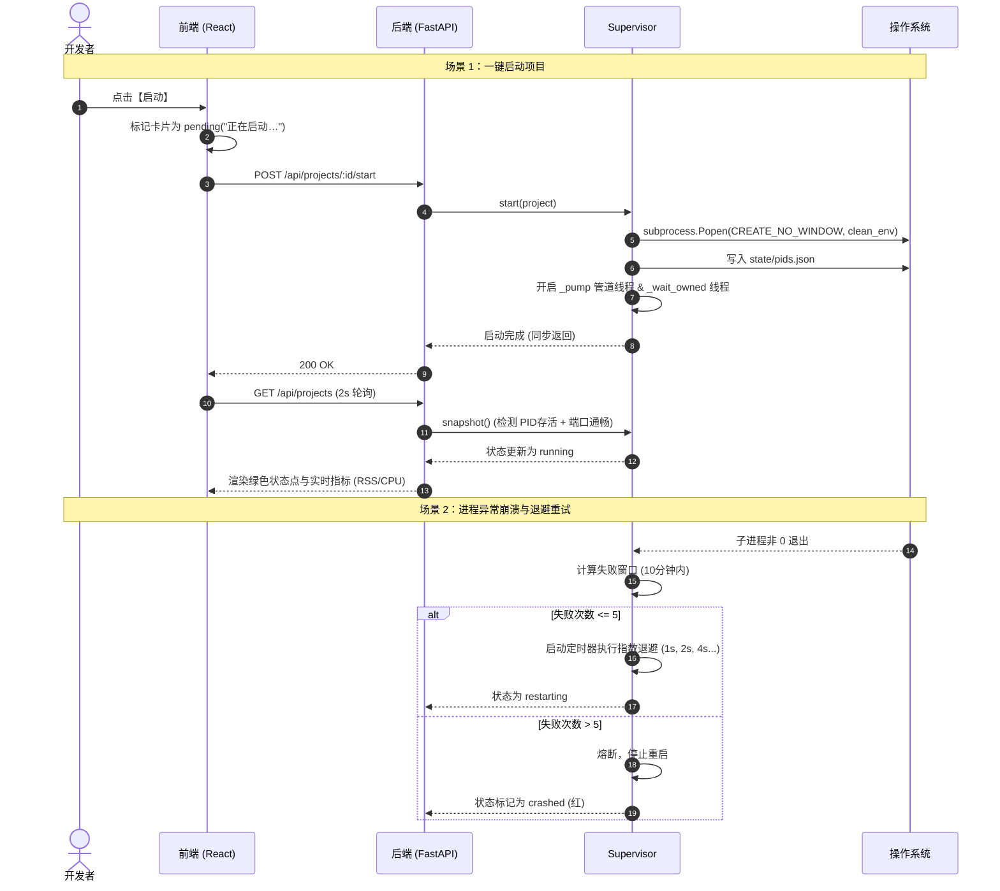

# 司命 · siming (devpanel) 架构学习与技术总结报告

> **项目名称**：司命 · siming (devpanel)  
> **定位**：Windows 本机开发项目控制台与进程守护者（Supervisor）  
> **核心技术栈**：Python 3.11+ / uv / FastAPI / psutil / React 19 / Vite / Tailwind CSS 4  
> **核心特性**：一页聚合、树形杀进程、外部实例认领、热重载、无缝状态继承、任务计划开机常驻、SSE 实时日志  

---

## 目录
1. [项目背景与核心价值](#1-项目背景与核心价值)
2. [总体架构与分层设计](#2-总体架构与分层设计)
3. [核心设计与技术亮点深入剖析](#3-核心设计与技术亮点深入剖析)
   - 3.1 为什么抛弃 PM2 自己做 Supervisor？
   - 3.2 严谨的 Windows 平台系统级特化处理
   - 3.3 声明式生命周期状态机与纯无状态推导
   - 3.4 进程跨生命周期保存与外部实例认领 (Adoption)
   - 3.5 健壮的日志体系与跨线程异步 SSE 流
   - 3.6 前端极致轻量与乐观交互设计
4. [关键工作流时序](#4-关键工作流时序)
5. [项目全景数据结构与 API 设计](#5-项目全景数据结构与-api-设计)
6. [对项目的深度看法与评价](#6-对项目的深度看法与评价)
   - 6.1 优秀之处与工程美学
   - 6.2 潜在边界与未来演进建议

---

## 1. 项目背景与核心价值

在本地全栈开发、独立开发或 AI 工具链开发中，开发者机器上往往常驻着十几个不同技术栈的 Web 服务：
- 前端框架：`npm run dev` (Vite, Next.js)
- Python 异步服务：`uv run uvicorn ...`
- 本地 AI Agent 工具：`npx -y @deepseek-ai/dsh ...`
- 监控小脚本：`python server.py ...`

**痛点矩阵：**
| 痛点场景 | 传统做法的问题 | 司命的解决方案 |
|---|---|---|
| **终端散落** | 开一堆 CMD / PowerShell 窗口，任务栏杂乱，经常误关 | 统一归并为一页 Web 控制台 (`127.0.0.1:9000`) |
| **端口冲突** | 经常忘记哪个项目占了哪个端口，或者关闭时子进程残留 | 精准探测端口占用，卡片直观显示，一键停止整棵树 |
| **进程悬挂** | `npm` 停了但 `node` 还在后台，端口被占 | 递归识别子进程树，反向由底至顶全部 `terminate` / `kill` |
| **外部运行失控** | 临时在终端跑的项目，面板看不到也管不了 | 扫描 TCP 监听端口，自动识别并标记为 `external` 纳入管理 |
| **面板重启** | 调试面板自身代码重启时，被管服务全部被迫退出 | 依靠 `pids.json` 记录 `pid + create_time`，热认领不杀项目 |

---

## 2. 总体架构与分层设计

```mermaid
flowchart TB
    subgraph Browser["用户浏览器 (Chrome/Edge)"]
        UI["React 19 + Tailwind 4 单页应用"]
        Poll["2s 轮询 /api/projects"]
        SSEStream["SSE 日志流 /api/projects/:id/logs/stream"]
    end

    subgraph Core["司命核心 (FastAPI @ 127.0.0.1:9000)"]
        API["api.py: REST 端点 + 静态产物托管"]
        Watcher["config.py: ConfigWatcher (mtime 监听)"]
        Sup["supervisor.py: Supervisor (进程控制调度中心)"]
        LogMgr["logs.py: LogManager (双缓冲 + 滚动 + 订阅)"]
    end

    subgraph OS["Windows 操作系统底层"]
        ProcTree["子进程树 (uv.exe / node.exe / python.exe)"]
        Ports["TCP 监听表 (psutil.net_connections)"]
        TaskSch["Windows 任务计划 (schtasks / pythonw)"]
        FS_State["state/pids.json (状态持久化)"]
        FS_Logs["logs/*.log (滚动日志文件)"]
    end

    UI -->|轮询状态| API
    UI -->|操作指令 (start/stop/restart)| API
    SSEStream -->|获取实时输出| API
    
    API --> Watcher
    API --> Sup
    API --> LogMgr

    Sup -->|CREATE_NO_WINDOW 派生| ProcTree
    Sup -->|psutil 杀树 / 探活 / RSS度量| ProcTree
    Sup -->|反查端口| Ports
    Sup -->|读写 PID 状态| FS_State
    LogMgr -->|管道读取写入| FS_Logs
    TaskSch -->|开机隐藏无窗口引导| Core
```

---

## 3. 核心设计与技术亮点深入剖析

### 3.1 为什么抛弃 PM2 自己做 Supervisor？
设计文档中清晰记录了决策过程，这是一个典型的**以问题为导向（Pragmatic）的架构决策**：
1. **Windows 平台水土不服**：PM2 依赖 Node.js 和命名管道（`//./pipe/rpc.sock`），在 Windows 下升级或权限变化时极易死锁形成僵尸 Daemon。
2. **进程层级杀不干净**：Windows 下 `npm` 是 `.cmd` 批处理，PM2 往往只杀了 `cmd.exe`，底层的 `node.exe` 依然活着，端口死锁。
3. **极简主义**：需求本质只是“启停、杀树、收集输出、探测端口、挂了退避重启”，使用 Python 的 `psutil` + `subprocess` 用数百行原生代码即可完全覆盖，不需要引入冗余的全局 Node 依赖。

---

### 3.2 严谨的 Windows 平台系统级特化处理

代码库中展现出对 Windows 进程与运行环境深厚的技术掌控力：

1. **子进程环境变量清洗 (`clean_path` & `STRIP_ENV`)**：
   - 面板自身是用 `uv run` 启动的，如果子进程直接继承 `os.environ`，其 `PATH` 最前端会是面板自身的虚拟环境（`.venv/Scripts`），且带有 `VIRTUAL_ENV`。
   - `config.py` 和 `supervisor.py` 主动剔除了 `VIRTUAL_ENV`、`UV_PROJECT_ENVIRONMENT`、`PYTHONHOME`、`PYTHONPATH`，并清洗了 PATH，确保被管项目调用 `python` 时准确执行该项目或系统自有的解释器。
2. **无黑窗口与新进程组**：
   - 采用 `creationflags = CREATE_NO_WINDOW | CREATE_NEW_PROCESS_GROUP`，既保证了面板在后台运行时完全无弹窗，又隔绝了控制台信号的连带影响。
3. **任务计划 vs Windows 服务**：
   - Windows Service 运行在 **Session 0**，该会话完全隔绝图形桌面，导致“在 VS Code 打开 (`code .`)”或“打开所在目录 (`explorer .`)”全部失效。
   - 司命采用 Windows Task Scheduler，在用户登录（Logon）时通过 `pythonw.exe` 启动，既享有完整的桌面交互权限，又无黑色控制台窗口，并且通过 XML 设定去除了 72 小时超时与电池限制。
4. **编码退避机制**：
   - Windows 控制台输出常常混杂 UTF-8 与系统默认的 GBK。`logs.py` 中的 `decode()` 采用 `UTF-8 -> GBK -> UTF-8(replace)` 三级安全回退，彻底规避中文环境下的解码崩溃。
5. **杀整棵进程树 (`kill_tree`)**：
   - 先反向递归获取整棵子进程树，优先自下而上发送 `terminate()`，等待 3 秒，若仍存活则执行 `kill()`，最后清理父进程，彻底杜绝孤儿进程。

---

### 3.3 声明式生命周期状态机与纯无状态推导

系统定义了极具表现力的 9 大运行状态：

```
[stopped 已停止] ──start()──► [starting 启动中] ──端口通──► [running 在线] ──退出(0)──► [stopped]
       ▲                             │ (>=60s 未通)              │ 退出(非0)
       │                             ▼                           ▼
       │                    [unhealthy 端口未开]          [restarting 退避中]
       │                                                         │ (10min内超5次)
       └──────── stop() (任一状态) ─────────────────────────► [crashed 已崩溃]
```
- **外部实例 (`external`)**：未被面板启动，但监听了目标端口，面板可显示指标并提供强行停止能力。
- **配置错误 (`error`)**：配置校验未通过，独立半透明显示，单项目故障绝不拖垮全局。
- **无状态现算**：状态不写在缓存中，每次前端轮询调用 `snapshot()` 时，现查 `alive()` + `listening_ports()` 动态判定，彻底消除了“缓存状态与操作系统真实状态脱节”的并发隐患。

---

### 3.4 进程跨生命周期保存与外部实例认领 (Adoption)

开发面板自身不可避免需要修改代码并重启。如何做到“面板重启，但十几个子项目保持运行”？
- **PID + CreateTime 双核验**：
  Windows 的 PID 是循环复用的。如果仅记录 PID，机器重启后该 PID 可能被系统其他关键进程（如 `svchost.exe`）占用，误认领将导致严重事故。
  司命在 `state/pids.json` 中持久化 `{pid, create_time, started_at, url}`。面板重启后，必须核验 `abs(p.create_time() - ct) <= 1.0`，完全一致才予认领。
- **认领后的保活监听**：
  认领回来的进程没有现成的 `Popen` 句柄，司命专门开启后台轮询线程（`_watch_adopted`），在进程最终结束时平滑过渡状态。

---

### 3.5 健壮的日志体系与跨线程异步 SSE 流

- **内存 + 磁盘双重保障**：
  - 内存端：每个项目维护 `deque(maxlen=2000)`，供前端瞬时拉取，无需每次读盘。
  - 磁盘端：单文件 5MB，滚动保留 3 份（`.log`, `.log.1`, `.log.2`），带时间戳分隔符。
  - 重启预热：面板重启时，自动从磁盘尾部读取 256KB 填补内存缓冲，抽屉展开瞬间绝无白屏。
- **线程安全的异步分发**：
  - 管道读取运行在操作系统原生线程，FastAPI SSE 运行在 asyncio 事件循环。
  - 使用 `loop.call_soon_threadsafe(q.put_nowait, line)` 桥接，既杜绝了线程与协程的死锁，又实现了高吞吐的近实时流式传输。

---

### 3.6 前端极致轻量与乐观交互设计

- **零重型组件库包袱**：没有 AntD、MUI 这类庞然大物，基于 Tailwind 4 变量与原生 CSS 封装核心 UI（Card, Drawer, Button, Menu）。
- **秒级乐观响应（Optimistic UI）**：
  在触发 start/stop 动作后，界面立即更新为 pending 态（“正在启动…”、“正在停止…”），无需等待 2 秒轮询周期，交互极其丝滑。
- **细节打磨**：
  - 日志抽屉支持智能跟随：用户一旦往上滚动，自动锁定停止滚底，并浮出“回到最新”按钮。
  - 动态网页标题：`3/6 在线 · 司命`，开发者无需切回标签页，仅凭浏览器 Tab 即可总览集群状态。

---

## 4. 关键工作流时序



---

## 5. 项目全景数据结构与 API 设计

### API 接口清单
| 方法 | 路径 | 核心功能 | 同步/异步特性 |
|---|---|---|---|
| `GET` | `/api/projects` | 获取所有项目状态、指标与全局错误 | 2s 轮询端点，瞬时现算 |
| `POST` | `/api/projects/:id/start` | 启动项目 | 同步：返回时已成功派生 |
| `POST` | `/api/projects/:id/stop` | 停止项目 | 同步：返回时整棵树已确认消亡 |
| `POST` | `/api/projects/:id/restart` | 重启项目 | 停止并轮询等待端口释放后启动 |
| `POST` | `/api/projects/start-all` | 启动全部未运行项目 | 后台队列错峰启动 (间隔 1s) |
| `POST` | `/api/projects/stop-all` | 停止全部在跑项目 | 同步批量杀树 |
| `GET` | `/api/projects/:id/logs` | 获取最近历史日志 | 读取内存环形缓冲区 |
| `GET` | `/api/projects/:id/logs/stream`| SSE 实时日志长连接 | 先回放 200 行，随后实时推流 |
| `POST` | `/api/projects/:id/open-folder` | 打开项目本地文件管理器 | 调用系统 `os.startfile` |
| `POST` | `/api/projects/:id/open-editor` | 用 VS Code 打开项目 | 调用后台 `code <cwd>` |
| `GET` | `/api/config` | 查看当前配置与解析错误 | 基于 mtime 自动热同步 |

---

## 6. 对项目的深度看法与评价

### 6.1 优秀之处与工程美学
1. **边界清晰，极其克制**：
   项目明确提出了“不做什么”——不做容器、不做多机器远程管理、不做权限控制。正因为边界极其收敛，它没有成为另一个臃肿难用的运维软件，而是变成了一个专为单机开发环境量身定制的高性能利器。
2. **直击 Windows 痛点，绝不妥协**：
   在跨平台软件中，Windows 往往是二等公民，经常面临孤儿进程、GBK 乱码、路径引号转义等隐蔽问题。本项目将 Windows 作为第一优先级（First-class citizen），把 Windows 特有的机制（任务计划、无窗口 flags、进程树查杀、端口归属）挖掘到了极致。
3. **架构的鲁棒性与无状态美学**：
   摒弃了易出错的复杂内存状态机缓存，选择在每次请求时通过 OS 原始指标推导状态，大大减少了脏数据风险；通过 `pids.json` 的指纹核验解决了守护面板自身重启的进程遗留问题。
4. **代码质量极高，测试扎实**：
   核心代码短小精悍（整个后端不到 1000 行），无多余抽象，注释直切要害。测试用例不是简单的 Mock，而是真实模拟 Socket 监听、非 0 退出、进程杀树与认领，22 个高可靠测试用例 5 秒内全绿通过。

### 6.2 潜在边界与未来演进建议

1. **安全防护（Local CSRF / Origin 校验）**：
   - *现状*：面板只监听 `127.0.0.1`，无鉴权机制，任何本地请求均可触发任意命令启停或文件打开。
   - *潜在风险*：若开发者在使用浏览器访问不受信任的外网网站时，恶意网站可能通过网页脚本向 `http://127.0.0.1:9000/api/...` 发起跨站请求（Drive-by 本地利用）。
   - *改进建议*：在中间件中增加基础的 HTTP Request Header 校验（如检查 `Origin`、`Referer` 或校验现代浏览器的 `Sec-Fetch-Site: same-origin`），或者在启动时生成随机 Local Token 放入 Header 中。
2. **HTTP 健康检查端点支持**：
   - *现状*：当前只做 TCP Port 连通性探测。
   - *场景*：现代前端工具链（如 Next.js、Nuxt）或大型 Python 服务，经常在第一秒就绑定了端口，但背后的 webpack/vite 编译或模型加载还需要 15 秒。
   - *改进建议*：支持可选的 `health_check: /api/health` 探针，当 HTTP 200 时才标记为真正的 `running`。
3. **前端反向配置同步 (v0.2 路线)**：
   - 当前在 `projects.yaml` 中手写配置体验良好，若能在前端卡片上支持“克隆项目”、“编辑命令”并借助 `ruamel.yaml` 保持注释回写，日常便利度将更上一层楼。
4. **研发工作流增强 (v0.3 路线)**：
   - 卡片若能显示当前仓库 Git 分支及未提交变更数，司命将不仅是一个进程管理器，而是升级为“全天候本地开发指挥舱”。
